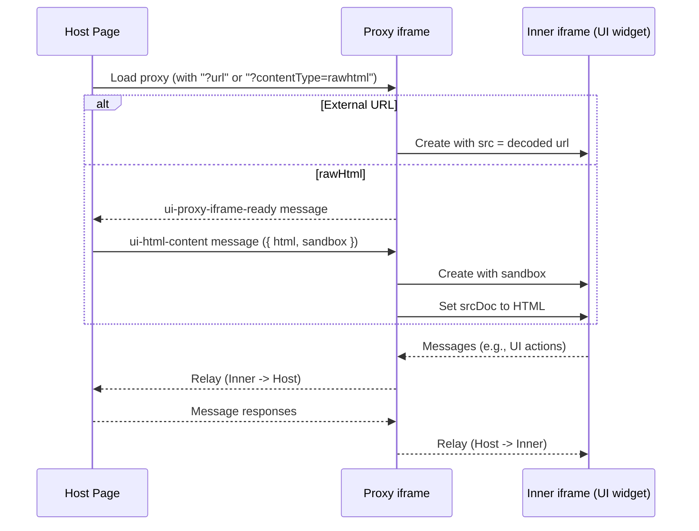

# Using a Proxy Script for External URLs and Raw HTML

When rendering external URLs (`text/uri-list`) or raw HTML (`text/html`), you may need to use a "proxy" to comply with your host's restrictive Content Security Policy (CSP). The proxy domain must be whitelisted as a `frame-src`. The `proxy` prop on `<UIResourceRenderer>` allows you to specify a URL for a proxy script that will render the content in a nested iframe on a different origin.

There are two proxy flows:

- External URLs: the external URL is encoded and appended as `?url=<encoded_original_url>` to the proxy URL. For example: `https://my-proxy.com/?url=<encoded_original_url>`.
- Raw HTML: the proxy is loaded with `?contentType=rawhtml`, and the HTML and inner iframe sandbox are delivered via `postMessage` after the proxy iframe signals it's ready.

::: tip Important
The term "proxy" in this context does not refer to a real proxy server. It is a static, client-side script that nests the UI resource's iframe within a "proxy" iframe. This process occurs locally in the user's browser. User data never reaches a remote server.
:::

## Using the Hosted Proxy

For convenience, `mcp-ui` provides a hosted proxy script at `https://proxy.mcpui.dev`. You can use this URL directly as the `proxy` prop value without any additional setup.

```tsx
import { UIResourceRenderer } from '@mcp-ui/client';

<UIResourceRenderer
  resource={mcpResource.resource}
  htmlProps={{
    proxy: 'https://proxy.mcpui.dev'
  }}
  onUIAction={handleUIAction}
/>
```

Please verify that the host whitelists `https://proxy.mcpui.dev` as a `frame-src` in the CSP.

You can find a complete example for a site with restrictive CSP that uses the hosted proxy at `examples/external-url-demo`.

## Architecture



## Self-Hosting the Proxy Script

If you prefer to host your own proxy script, you can create a simple HTML file with embedded JavaScript. This is a useful alternative to the hosted version when you want more control or a custom domain.

**IMPORTANT**: For security reasons, you **MUST NOT** host the proxy script on the same origin as your main application. `mcp-ui/client` will automatically log an error and fallback to direct iframe if the same origin is detected.

### Proxy Script Requirements

A valid proxy script must:

1.  **External URLs (`url` query parameter)**: Retrieve `url` from the query string, validate it as `http:`/`https:`, and render it in a nested iframe.
2.  **Raw HTML (`contentType=rawhtml`)**: When `contentType=rawhtml` is present, the proxy must:
    - Create a nested iframe and emit a ready signal (`ui-proxy-iframe-ready`) to `window.parent`.
    - Receive a single `postMessage` with `{ html: string, sandbox?: string }` (message type e.g. `ui-html-content`).
    - Apply `sandbox` to the inner iframe, then set the inner iframe `srcdoc` to the provided HTML.
3.  **Sandbox the Iframe**: The nested iframe must be sandboxed to restrict capabilities. For external URLs a minimal policy is `allow-scripts allow-same-origin`; for raw HTML a minimal policy is `allow-scripts` unless you explicitly need additional capabilities.
4.  **Forward `postMessage` Events**: To allow communication between the host application and the embedded external URL, the proxy needs to forward `message` events between `window.parent` and the iframe's `contentWindow`. For security, it's critical to use a specific `targetOrigin` instead of `*` in `postMessage` calls whenever possible. The `targetOrigin` for messages to the iframe should be the external URL's origin; Messages to the parent will default to `*`.
5.  **Permissive Proxy CSP**: Serve the proxy page with a permissive CSP that does not block nested iframe content (e.g., allowing scripts, styles, images) since the host CSP is intentionally not applied on the proxy origin.

### Example Self-Hosted Proxy

Here is an example of a self-hosted proxy script that meets these requirements (supports both `url` for external URLs and `contentType=rawhtml` + `postMessage` for raw HTML). You can find this file in `sdks/typescript/client/scripts/proxy/index.html`.

<<< @/../../sdks/typescript/client/scripts/proxy/index.html 
